#### Advanced Lane Finding.

The goals / steps of this project are the following:
- Compute the camera calibration matrix and distortion coefficients given a set of chessboard images.
- Apply a distortion correction to raw images.
- Use color transforms, gradients, etc., to create a thresholded binary image.
- Apply a perspective transform to rectify binary image ("birds-eye view").
- Detect lane pixels and fit to find the lane boundary.
- Determine the curvature of the lane and vehicle position with respect to center.
- Warp the detected lane boundaries back onto the original image.
- Output visual display of the lane boundaries and numerical estimation of lane curvature and vehicle position.

##### Camera Calibration:
- The code for calibration is located in calibrate() in src/calibration.py
- Initially chess board corners are searched for using findChessboardCorners() of opencv with initial pattern size of (8, 6). In case of failure with this pattern size, other size of (8, 5) and (9, 5) are tried. This approach allowed the calibration to work on all test images.
- The detected points are used as the source points, while destination is fixed and calculated as:
				dst = np.float32([[offset, offset], [img_size[0] - offset,
                              offset], [img_size[0] - offset, img_size[1] - offset], [offset, img_size[1] - offset]])
                              
- Offset in the above value is arbitrarily selected and in this case its set to 100.
- The source and destination points were used to calibrate camera to calculuate distortion coefficient and camera matrix.
- Provided below are few images after distortion were removed using these calculated coeffcients.
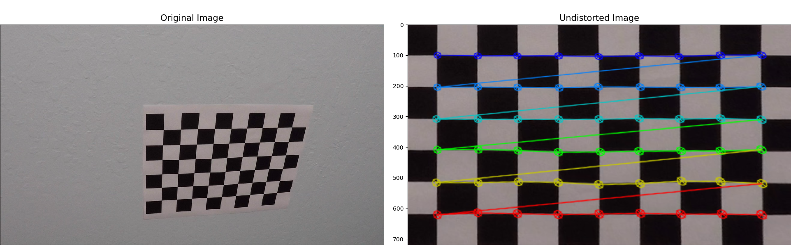  
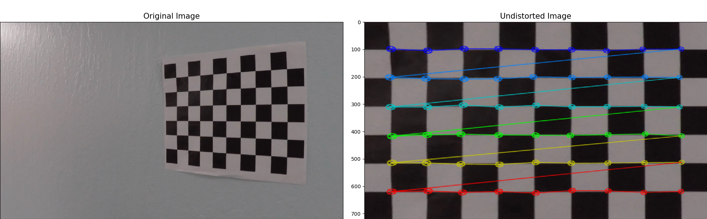  
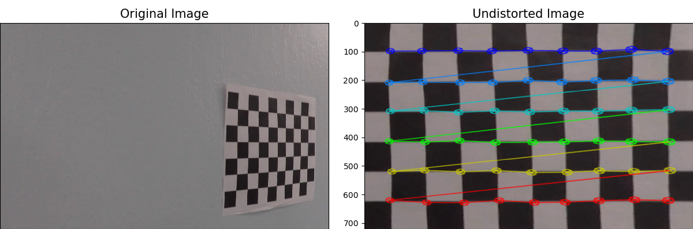  

- Shown below is undistorted test frame.  
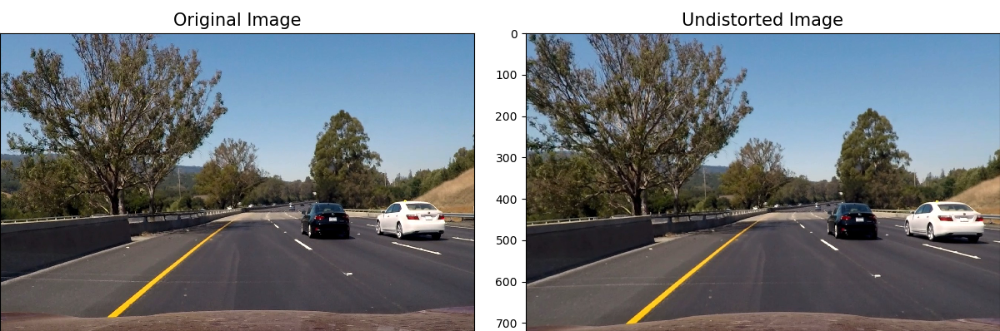 

#### Image Transformations.
- Image is binarized and feature extracted in binarize_image() in image_handler.py.
- A combination of masked S field of HSV colorspace, S field of HLS colorspace and R field of RGB were used to create the binarized image.   
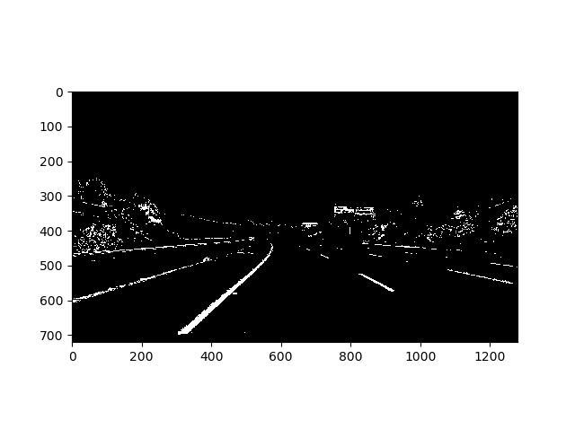

#### Image Pipeline
- A Region mask was applied to extract area of interest with lane lines, this is implemented in create_perspective_transform() in iamge_handler.py.  

| Source  |Destination   |
|---|---|
|  591.35,   446.39  | 400.,    0.  |
|   687.35,   446.39 |  880.,    0.  |
|  1192.95,   720. | 880.,  720.  |
|  204.80,   720. |  400.,  720. |  

- Above mask was applied to the binarized image to retrieve a clean version of image for processing as shown below.
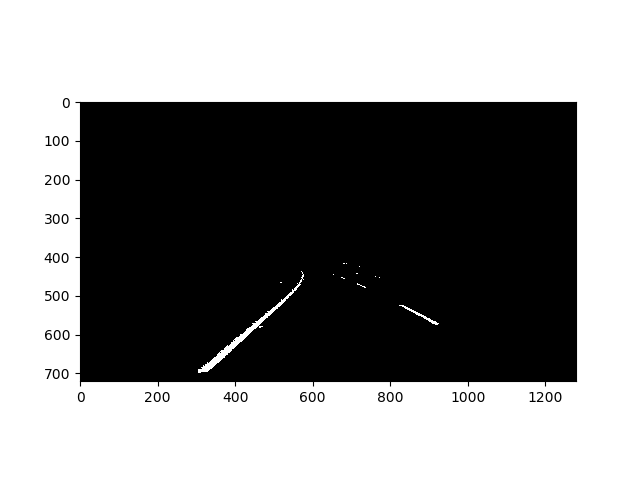  
- The binarized image is then warped.
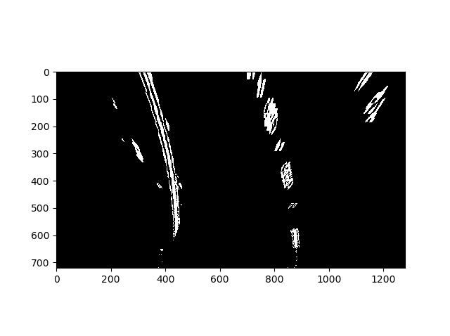  
- The warped image is used to detect histogram points. As the histogram points detected are noisy, its smoothed over using medfilt of scipy signal toolkit.  
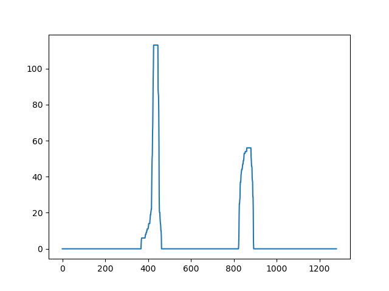
- Histogram points are used to detect no zero points at an offset += 100 from the max points of histogram. These points are used to fit the x-axis for the curve.
- Histogram detection is expensive operation and is used for initial frame or when no lane lines have been detected for a prolonged period of time. 
- Once a resonable set of points have been detected, locality search around these points are done in further frames.
- The detected points are smoothed over 6 frames in a rolling window approach using deque.
- If locality search fails for 6 frames, a new histogram search is initiated.
- The locality search and histogram search are implemented in lanes.py in locality_search() and histogram_detect() respectively.
- Figure below shows the fitted curved region in warped image. 
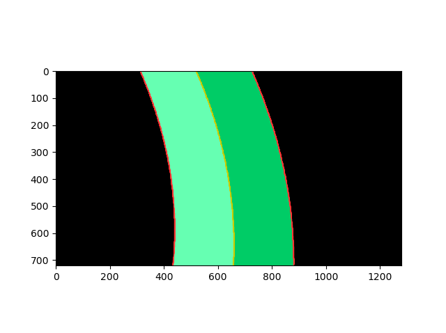  
- The lane line visualization is done in visualize.py in lane_visualize(). The lane area is drawn with gradient for left and right sections of the lanes.
- The warped image with lane area marked is then warped back, and resulting image is shown below.  
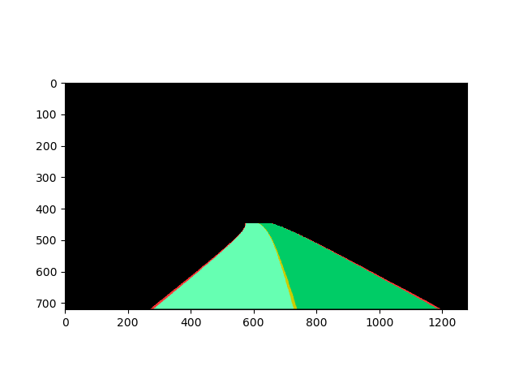
- The lane region marked above is then merged with the input image.
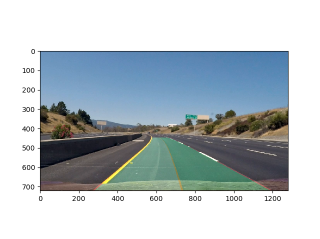.
- Finally radius of curvature and distance from the center of lane(which is assumed to be center of frame) is drawn on the image.  
.

#### Lane Curvature:
- The lane curvature is used to check the sanity of the curves fit using histogram search or using locality search.
- Lane curvature is calculated in calculate_curvature() in lanes.py.
- Lane curvature is limited in range 600 - 1300 m.
- Similarly rate of change of curvature of left curvature and right curvature with respect to its previous value is limited to 0.05.
- These checks are implemented in sanity_check_curvature() in lanes.py.
- Any values of curvature that deviates from these constraints results in a dropped frame and previous values of lane points are used for marking lanes, provides dropped frame count has not exceeded 6. If drop count exceed 6, a new histogram search is initiated.(pipeline() in lanes.py)

#### Pipeline(Video).
- The implementation was applied to a project video and the resulting output is stored in [.output.mp4](./output/output.mp4) in output folder.

#### Issues.
- The implementation though does resonably well shows few wobbly lines.
- The restriction on the curvature range will cause implementation to break probably on video with higher curvature values.
